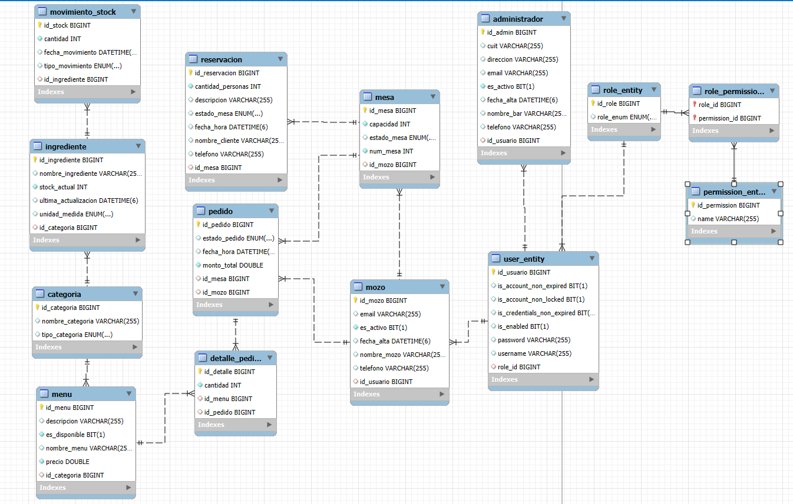

<h1>Comanda Backend</h1

Aplicación monolítica que centraliza la gestión de un bar, permitiendo controlar productos, menús, clientes y pedidos de forma eficiente.

<h2>Diagrama de Base de Datos</h2>

<h2>Tecnologías utilizadas</h2>

⭐️ Java 17+ / Spring Boot 3.4

⭐️ Spring Security con autenticación y autorización basada en JWT (JSON Web Tokens)

⭐️ Hibernate / JPA

⭐️ MySQL

⭐️ Swagger / OpenAPI

<h2>Cómo ejecutar el proyecto</h2>

Esta es una <strong>aplicación monolítica</strong> desarrollada en Java con Spring Boot que centraliza la gestión integral de un bar. Permite administrar productos, menús, clientes y pedidos de forma eficiente y sencilla.

<h3>Requisitos previos</h3>
<ul>
  <li>Tener instalado Java 17 o superior.</li>
  <li>Tener instalado MySQL </li>
  <li>Configurar las variables de entorno necesarias (ejemplo en archivo <code>.env</code> o en tu entorno local).</li>
</ul>

<h3>Variables de entorno necesarias</h3>

Configura las siguientes variables en tu entorno o en un archivo <code>.env</code> (que <strong>no debe subirse a Git</strong>):

<pre>
DB_USER=root
DB_PASSWORD=tu_password
DB_URL=jdbc:mysql://localhost:3306/nombre_basedatos
SECRET_KEY=tu_clave_secreta_para_jwt
</pre>

Asegúrate de modificar los valores según tu configuración local.

<h3>Pasos para ejecutar</h3>
<ol>
  <li>Clonar el repositorio:
    <pre>git clone https://github.com/tu_usuario/tu_repositorio.git
cd tu_repositorio</pre>
  </li>
  <li>Configurar las variables de entorno según corresponda.</li>
  <li>Construir el proyecto con Maven o Gradle (según corresponda):
    <pre>./mvnw clean install
-- o --
./gradlew build</pre>
  </li>
  <li>Ejecutar la aplicación:
   Ejecutar la aplicación:
  
Antes de ejecutarlo, debes declarar las variables en la consola manualmente, de la siguiente manera:

    
Ejemplo: 

  
<code>$env:DB_USER="valor"</code>

  
Luego, ejecuta el siguiente comando:

  <pre>./mvnw spring-boot:run</pre>
-- o --
java -jar target/nombre-del-jar.jar</pre>
  </li>
  <li>Acceder a la API en:
    <pre>http://localhost:8080</pre>
  </li>
  <li>Para la documentación Swagger, visitar:
    <pre>http://localhost:8080/swagger-ui.html</pre>
  </li>
</ol>
